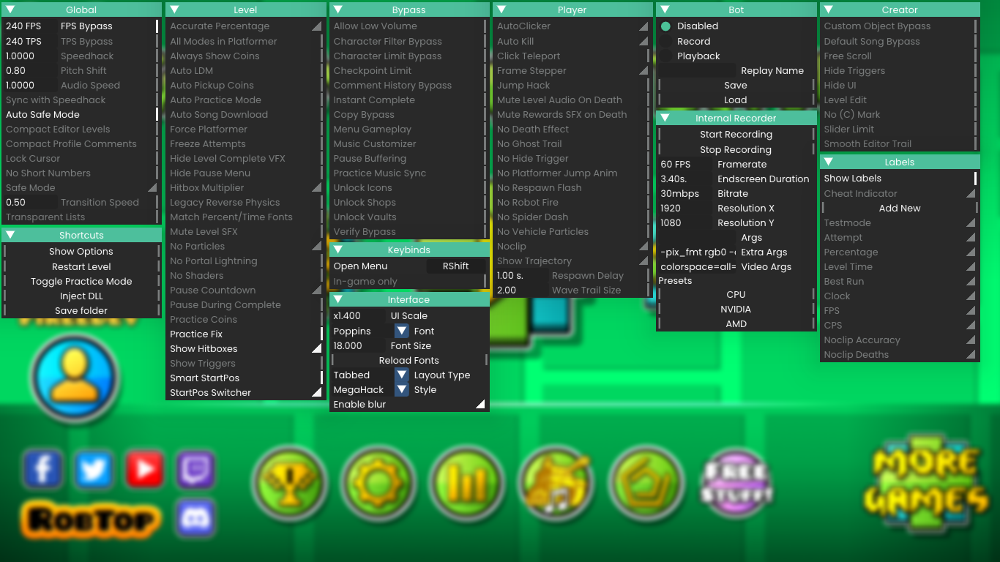
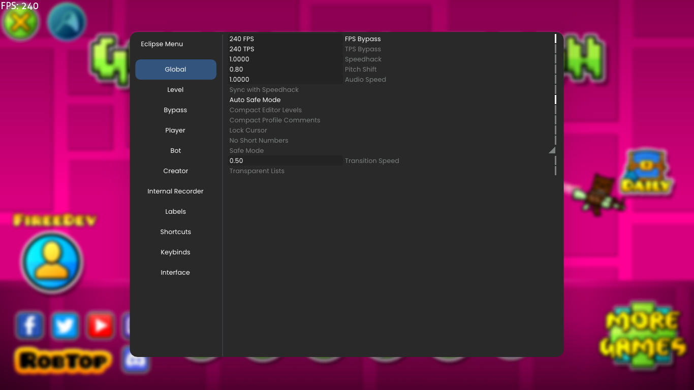

<div align="center">
   <a href="https://github.com/EclipseMenu/EclipseMenu">
      
   </a>
   <h1 align="center">Eclipse</h1>
   <p align="center">
      A next-generation mod menu for Geometry Dash.
   </p>
</div>
<div align="center">
    <a href="https://github.com/EclipseMenu/EclipseMenu/latest">
          
    </a>
    
    
    <a href="LICENSE">
      
    </a>
    <a href="https://github.com/EclipseMenu/EclipseMenu/issues">
      
    </a>
    <a href="https://discord.gg/NnpwFRDMND">
      
    </a>
</div>
<br>

## Tabbed Style


## Panel Style 


## How to install
1. Install [Geode](https://geode-sdk.org) if you haven't already!
2. Open Geometry Dash
3. Click on the Geode button
4. Navigate to the **Download** tab, and search "Eclipse"
5. Click on **View**, and **Download**. You should now have **Eclipse Menu** after restarting!

## How to use
1. On PC, press `TAB` to open and close the mod menu.
2. Set or toggle any hack / mod you want to use.
3. For any questions or general support, join our [Support Discord Server](https://discord.gg/NnpwFRDMND)!
4. Have fun using our mod!

## Features
- 90+ hacks
- Startpos Switcher (with Smart Smartpos!)
- Fully Customizable Labels
- Show Trajectory
- Internal Recorder
- Replay Bot
- Keybinds
- Theme Customizability (you can theme Eclipse Menu however you want!)

## Build Instructions
1. You must have the following: `CMake`, `MSVC / Clang`, `Git`, `Geode CLI`, `Geode SDK`
```bash
git clone https://github.com/EclipseMenu/EclipseMenu
cd EclipseMenu
cmake -B build -DCMAKE_BUILD_TYPE=RelWithDebInfo
cmake --build build --config RelWithDebInfo
```

## Credits
This mod menu would not be possible without the developers from other mod menus teaming up together!
- [ninXout](https://github.com/ninXout) ([Crystal Client](https://github.com/ninXout/Crystal-Client))
- [prevter](https://github.com/Prevter) ([OpenHack](https://github.com/Prevter/OpenHack))
- [maxnut](https://github.com/maxnut) ([GD Mega Overlay](https://github.com/maxnut/GDMegaOverlay))
- [Firee](https://github.com/FireMario211) ([Prism Menu](https://github.com/FireMario211/Prism-Menu))
- [SpaghettDev](https://github.com/SpaghettDev)

Additionally, thank you to our testers, contributors, and supporters for improving and helping make Eclipse Menu possible!
- [Tallen](https://tallensuired.carrd.co/) - Tester & Helped support **Eclipse Menu** by donating!
- [hiimjustin000](https://github.com/hiimjustin000) - Contributor
- [RayDeeUx](https://github.com/RayDeeUx) - Contributor
- [iAndyHD3](https://github.com/iAndyHD3) - Contributor
- [Tech](https://github.com/TechStudent11) - Contributor
- [alex](https://www.youtube.com/channel/UC4SWcPASJplMrIT6YI8QcSw) - Tester
- itsmeatomic - Tester
- jettjames - Tester
- doki - Tester
- [Prometheus](https://github.com/Prometheus-03) - Tester
- [Catto](https://github.com/CattoDev/GatoBot/) - ShaderLayer fix for renderer

## License
**Eclipse Menu** is created under the **[Eclipse Public License v2.0](https://choosealicense.com/licenses/epl-2.0/)**, read more by clicking on the highlighted name.
